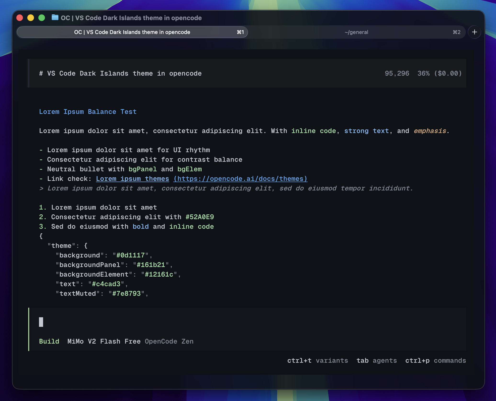

# opencode-dark-islands

An OpenCode theme inspired by [VS Code Dark Islands](https://github.com/bwya77/vscode-dark-islands)



## install

OpenCode custom theme docs: https://opencode.ai/docs/themes

For a user-wide install:

```bash
mkdir -p ~/.config/opencode/themes
cp islands-dark.json ~/.config/opencode/themes/islands-dark.json
```

Then set the theme in `~/.config/opencode/tui.json`:

```json
{
  "$schema": "https://opencode.ai/tui.json",
  "theme": "islands-dark"
}
```

If you want the theme only for one project, put it in a local theme directory instead:

```bash
mkdir -p .opencode/themes
cp islands-dark.json .opencode/themes/islands-dark.json
```

Then pick `islands-dark` from OpenCode with `/theme`, or set the same theme name in your `tui.json`.

## notes

- OpenCode looks best with truecolor enabled. `echo $COLORTERM` should print `truecolor` or `24bit`.
- Theme lookup order comes from the docs: built-in themes, user themes, project-root themes, then the current working directory.
- If you want the extra "glass" feel from the screenshot, pair this with a terminal that supports blur, opacity, and good font rendering like Ghostty.
